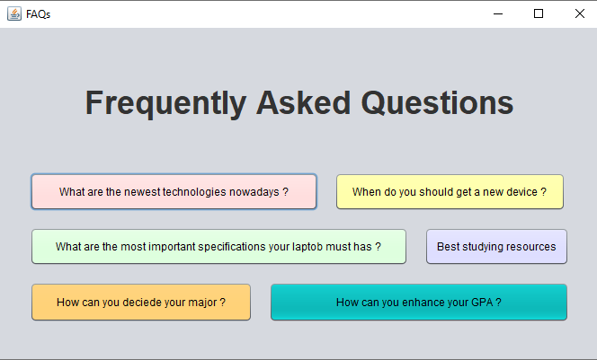
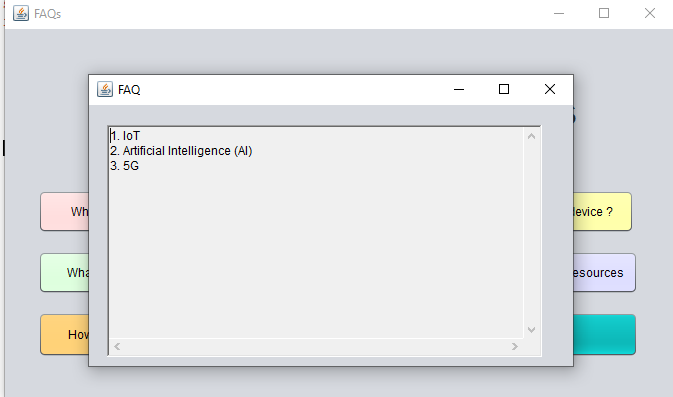
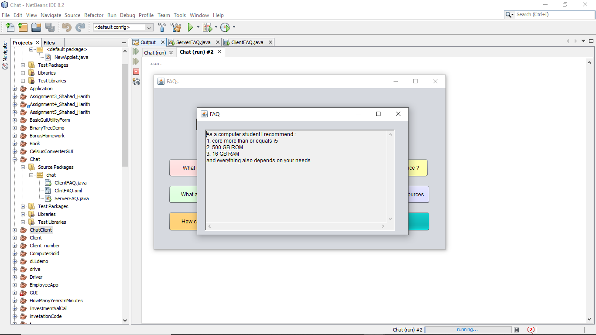
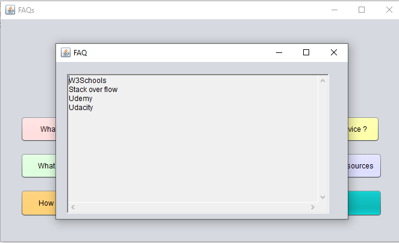
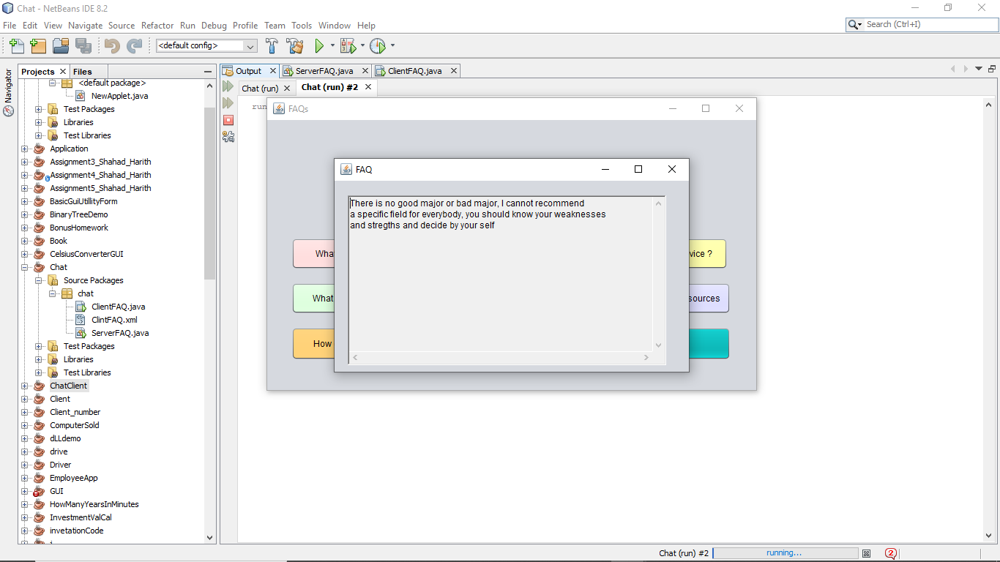
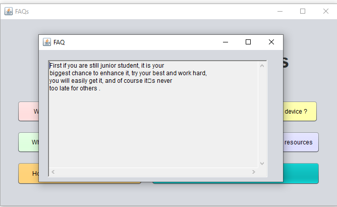

# FAQs
Java Network program provides clients to ask the server questions those are already existed,
and read the answers from a file using datagram socket and packet.

## Home page
This is the main interface that will appear to clients , it contains six buttons as you can see here, 
whenever clients press a button, the server will read from a file the proper answer for every button . 

### First Button

### Second Button

### Third Button

### fourth Button

### Fifth Button

### Sixth Button

